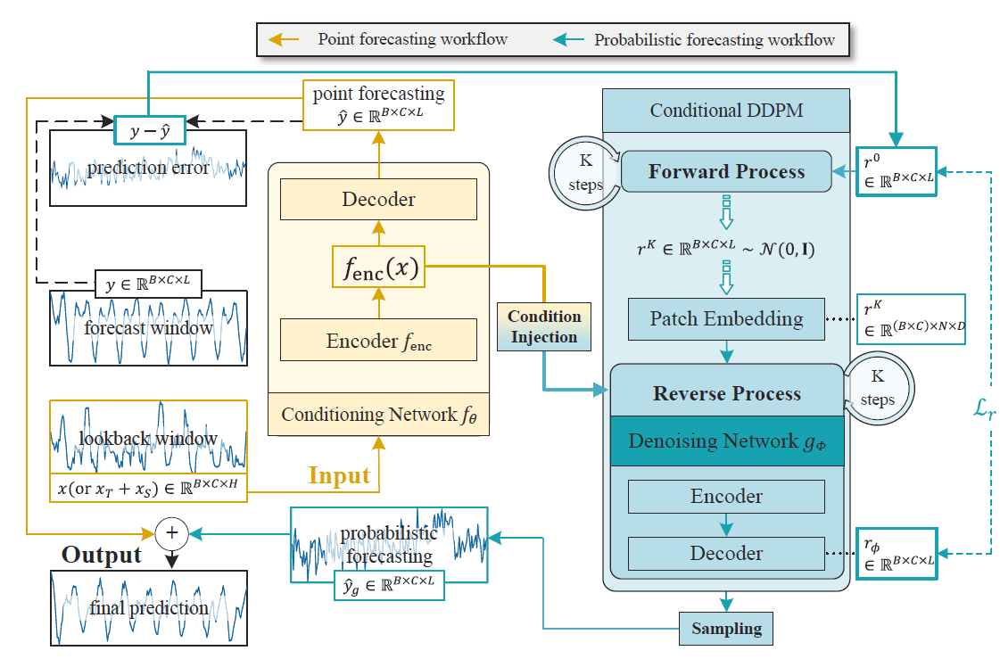

# D^3U
The repo is the official implementation for the paper: [Diffusion-based Decoupled Deterministic and Uncertain Framework for Probabilistic MTS Forecasting](https://openreview.net/forum?id=HdUkF1Qk7g)

## Overall Architecture

## Usage
Train and evaluate the model. We provide all the above tasks under the folder ./scripts/. You can reproduce the results as the following examples:
<div style="position: relative;">
  <pre>
    <code id="codeBlock">
# D3U Multivariate Probabilistic forecasting where SparseVQ functions as the conditioning network and PatchDN serves as the denoising
network.
bash ./scripts/SVQ/exp_study/
    </code>
  </pre>
  <button style="position: absolute; top: 0; right: 0; padding: 5px; background: #f5f5f5; border: none; cursor: pointer;" onclick="copyCode()">
    📋
  </button>
</div>

The datasets can be obtained from [Google Drive](https://drive.google.com/file/d/1l51QsKvQPcqILT3DwfjCgx8Dsg2rpjot/view?usp=drive_link) or [Baidu Cloud](https://pan.baidu.com/s/11AWXg1Z6UwjHzmto4hesAA?pwd=9qjr).

## Contact
If you have any questions or want to use the code, feel free to contact:

- ​**Qi Li**: [li.q@bupt.edu.cn](mailto:li.q@bupt.edu.cn)
- ​**Zhenyu Zhang**: [zhangzhenyucad@bupt.edu.cn](mailto:zhangzhenyucad@bupt.edu.cn)


## Citation
If you find this repo helpful, please cite our paper.

```markdown
@inproceedings{li2025diffusion,
  title={Diffusion-based decoupled deterministic and uncertain framework for probabilistic multivariate time series forecasting},
  author={Li, Qi and Zhang, Zhenyu and Yao, Lei and Li, Zhaoxia and Zhong, Tianyi and Zhang, Yong},
  booktitle={The Thirteenth International Conference on Learning Representations},
  year={2025}
}

Place the checkpoint of the already trained point prediction model into this folder.
path: pretrain_checkpoints/SVQ/all/weather/192/checkpoint.pth
